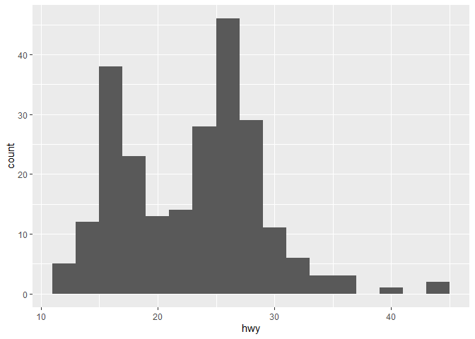
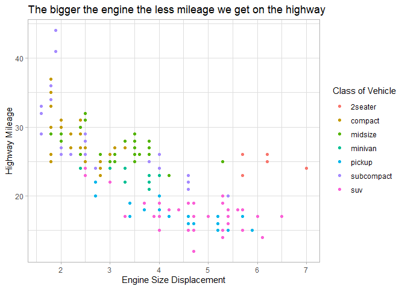
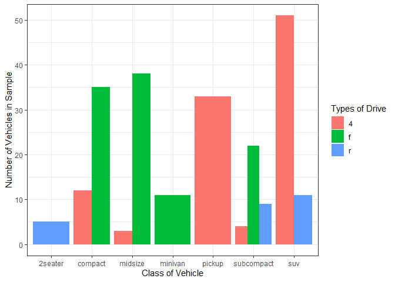

# Visualize Data
Bianca Rodas

## Your Turn 0

Add a setup chunk that loads the tidyverse packages.

``` r
head(mpg)
```

    # A tibble: 6 × 11
      manufacturer model displ  year   cyl trans      drv     cty   hwy fl    class 
      <chr>        <chr> <dbl> <int> <int> <chr>      <chr> <int> <int> <chr> <chr> 
    1 audi         a4      1.8  1999     4 auto(l5)   f        18    29 p     compa…
    2 audi         a4      1.8  1999     4 manual(m5) f        21    29 p     compa…
    3 audi         a4      2    2008     4 manual(m6) f        20    31 p     compa…
    4 audi         a4      2    2008     4 auto(av)   f        21    30 p     compa…
    5 audi         a4      2.8  1999     6 auto(l5)   f        16    26 p     compa…
    6 audi         a4      2.8  1999     6 manual(m5) f        18    26 p     compa…

## Your Turn 1

Run the code on the slide to make a graph. Pay strict attention to
spelling, capitalization, and parentheses!

``` r
ggplot(mpg)+
  geom_point(aes(x=displ, y=hwy))
```


## Your Turn 2

Replace this scatterplot with one that draws boxplots. Use the
cheatsheet. Try your best guess.

``` r
ggplot(data = mpg) +
  geom_boxplot(mapping = aes(x = class, y = hwy))
```


## Your Turn 3

Make a histogram of the `hwy` variable from `mpg`. Hint: do not supply a
y variable.

``` r
ggplot(data = mpg) +
  geom_histogram(mapping = aes(x= hwy))
```

    `stat_bin()` using `bins = 30`. Pick better value with `binwidth`.


## Your Turn 4

Use the help page for `geom_histogram` to make the bins 2 units wide.

``` r
ggplot(data = mpg) +
  geom_histogram(mapping = aes(x= hwy),
                 binwidth=2)
```



## Your Turn 5

Add `color`, `size`, `alpha`, and `shape` aesthetics to your graph.
Experiment.

``` r
ggplot(data = mpg) +
  geom_point(mapping = aes(x = displ, y = hwy, 
                           color=class))+
  labs(x="Engine Size Displacement",
       y= "Highway Mileage",
       color="Class of Vehicle",
       title="The bigger the engine the less mileage we get on the highway")+
  theme_light()
```



## Help Me

What do `facet_grid()` and `facet_wrap()` do? (run the code, interpret,
convince your group)

``` r
# Makes a plot that the commands below will modify
q <- ggplot(mpg) + geom_point(aes(x = displ, y = hwy))

q + facet_grid(. ~ cyl)
```


``` r
q + facet_grid(drv ~ .)
```


``` r
q + facet_grid(drv ~ cyl)
```


``` r
q + facet_wrap(~ class)
```


## Your Turn 6

Make a bar chart `class` colored by `class`. Use the help page for
`geom_bar` to choose a “color” aesthetic for class.

``` r
ggplot(mpg)+
  geom_bar(aes(x=class, fill=drv),
           position="dodge")+
  labs(x="Class of Vehicle",
       y="Number of Vehicles in Sample",
       fill="Types of Drive")+
  theme_bw()
```



## Quiz

What will this code do?

``` r
ggplot(mpg, aes(x=displ, y= hwy)) + 
  geom_point(aes(color=class)) +
  geom_smooth(color="black", se=F,
              method="lm")+
  scale_color_viridis_d()
```

    `geom_smooth()` using formula = 'y ~ x'


``` r
#ggsave("example.jpg", width=6, height=4)
```

------------------------------------------------------------------------

# Take aways

You can use this code template to make thousands of graphs with
**ggplot2**.

``` r
ggplot(data = <DATA>) +
  <GEOM_FUNCTION>(mapping = aes(<MAPPINGS>))
```
